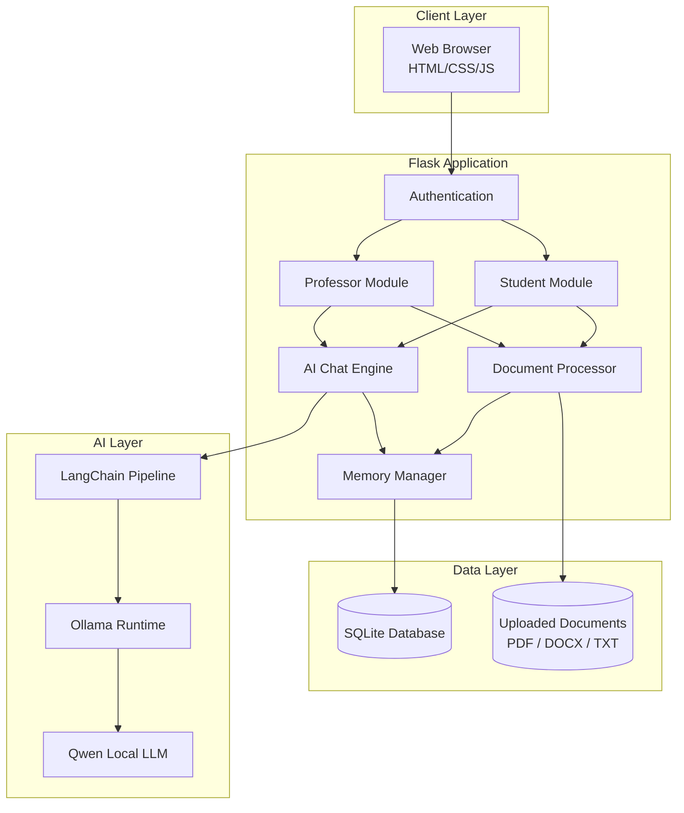
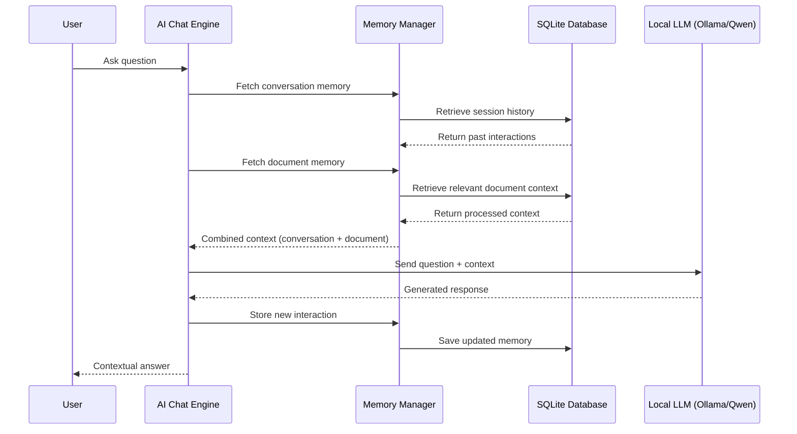
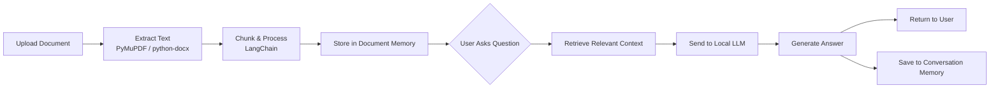

# 🎓 Studiora AI

> **An AI-powered educational platform for personalized, document-based learning and intelligent academic assistance.**


---

## 📝 Problem Statement

Rural students often face limited or no access to reliable internet connectivity and digital learning resources. This creates a significant gap in access to modern educational tools, personalized guidance, and quality study materials. Students may have textbooks and notes available, but lack the digital knowledge and infrastructure required to effectively use online learning platforms and AI-based educational resources.

Studiora AI aims to bridge this digital and educational gap by providing an offline-first AI learning environment that allows students to learn from their own textbooks and study materials, interact with an AI tutor, generate useful learning resources, and continue learning without depending continuously on internet connectivity.

---

## 📖 Overview

Studiora AI is an intelligent educational platform designed to bridge the gap between traditional learning and Artificial Intelligence.

Students can upload textbooks, notes, and academic materials, ask contextual questions, and generate summaries and study resources. Professors can manage learning materials, monitor student activities, and interact with an AI assistant designed specifically for educators.

The platform is built entirely in Python using Flask and supports both online and offline AI models.

---

## 🏗️ System Architecture



---

## 🧠 Memory System

Studiora AI includes an intelligent memory mechanism that enables contextual and continuous conversations instead of isolated responses.

### How It Works



### Features

- **Conversation Memory** — Remembers previous interactions within a chat session, allowing natural follow-up questions without repeating context.
- **Document Memory** — Stores the processed context of uploaded documents and retrieves relevant information when answering questions.
- **Context Retention** — Maintains conversation flow by remembering earlier topics discussed by the user.
- **Session-Based Memory** — Keeps AI responses consistent throughout the current learning session.
- **Contextual Retrieval** — Retrieves only the most relevant portions of uploaded study material before generating answers.
- **Personalized Learning Context** — Uses previous interactions to provide more meaningful and personalized responses.
- **Multi-Document Context** — Supports understanding and answering questions across multiple uploaded documents.
- **Efficient Memory Management** — Avoids reprocessing the same document repeatedly, reducing response time and improving efficiency.

### Benefits

- More human-like conversations
- Better contextual understanding
- Reduced repetitive questioning
- Faster document-based responses
- Improved learning continuity

---

## 🚀 Features

### 👨‍🎓 Student Module

- Secure Authentication
- Personalized Dashboard
- AI Chat Assistant
- Document Upload (PDF, DOCX, TXT)
- Context-aware Question Answering
- Document & Conversation Memory
- Study History
- Personalized Learning
- AI Generated Notes, Summaries & Practice Questions
- Offline Study Support
- Progress Tracking & Learning Statistics
- Profile Management

### 👨‍🏫 Professor Module

- Secure Authentication
- Professor Dashboard
- Student Management
- Document Management
- AI Assistant for Teaching
- View Student Activities
- Upload Learning Materials
- Search Students & Documents
- Learning Analytics
- Profile Management

---

## 🔄 Document Q&A Flow



---

## 🧠 AI Capabilities

Studiora AI can:

- Answer contextual questions
- Remember previous conversations
- Understand uploaded documents
- Generate structured notes and summaries
- Explain concepts
- Provide personalized learning
- Maintain document context
- Support offline AI models
- Generate academic content
- Help professors prepare learning materials

---

## 📂 Supported Documents

| Format | Status |
|--------|--------|
| PDF | ✅ Supported |
| DOCX | ✅ Supported |
| TXT | ✅ Supported |
| PPTX | 🔜 Planned |
| Images / OCR | 🔜 Planned |
| Scanned Notes | 🔜 Planned |

---

## 💻 Technology Stack

**Frontend**
- HTML5, CSS3, JavaScript

**Backend**
- Python, Flask

**Database**
- SQLite

**AI**
- Ollama, Qwen Models, Local LLMs

**Libraries**
- LangChain, PyMuPDF, python-docx, SQLite3

---

## 📁 Project Structure

```
StudioraAI/
│
├── static/           # CSS, JS, images
├── templates/         # HTML templates
├── uploads/           # User-uploaded documents
├── student/           # Student module logic
├── professor/         # Professor module logic
├── database/          # Database files & schema
├── models/            # AI / memory model logic
├── app.py             # Application entry point
├── requirements.txt   # Python dependencies
└── README.md
```

---

## 💾 System Requirements

| Tier | Specs |
|------|-------|
| **Minimum** | Windows 10 / Linux · Intel i5 8th Gen or Ryzen 5 · 8 GB RAM · 10 GB free storage |
| **Recommended** | Intel i7 / Ryzen 7 · NVIDIA RTX 3060+ · 16 GB RAM · SSD · CUDA support |
| **Best Experience** | RTX 4050+ · 32 GB RAM · NVMe SSD |

---

## ⚙️ Installation

**1. Clone the repository**
```bash
git clone https://github.com/YOUR_USERNAME/StudioraAI.git
```

**2. Move into the project directory**
```bash
cd StudioraAI
```

**3. Create a virtual environment**

Windows:
```bash
python -m venv venv
venv\Scripts\activate
```

Linux / Mac:
```bash
python -m venv venv
source venv/bin/activate
```

---

## ▶️ Running the Project

Start the application:
```bash
python run.py
```
or
```bash
flask run
```

Then open your browser at:
```
http://127.0.0.1:5000
```

---

## 🤖 Running AI Models

**1. Install Ollama**
Download from [ollama.com](https://ollama.com)

**2. Pull a model**
```bash
ollama pull qwen2.5:7b
```

**3. Run the model server**
```bash
ollama serve
```

The Flask backend will automatically communicate with the local model.

---

## 📚 Current Functionalities

- ✅ Authentication
- ✅ Student Dashboard
- ✅ Professor Dashboard
- ✅ AI Chat
- ✅ Document Upload
- ✅ Context Retrieval
- ✅ Conversation Memory
- ✅ Profile Management
- ✅ Learning Progress
- ✅ Offline AI Support

---

## 🔜 Future Roadmap

- Voice Learning
- OCR Support
- Multi-language Support
- AI Exam Evaluation
- Vision OMR Integration
- Assignment Evaluation
- Research Assistant
- Mobile Application
- Cloud Synchronization

---

## 🎯 Use Cases

- Schools
- Colleges
- Universities
- Coaching Institutes
- Self Learning
- Offline Learning
- Rural Education

---


## 🤝 Team Members

Shrikant.M.B - 
Sujan.P.R - 
Niharika - 
Shreya B J - 

---

## ⭐ Support

If you found this project useful:

- ⭐ Star the repository
- 🍴 Fork the repository
- 📢 Share with others

Contributions are always welcome!